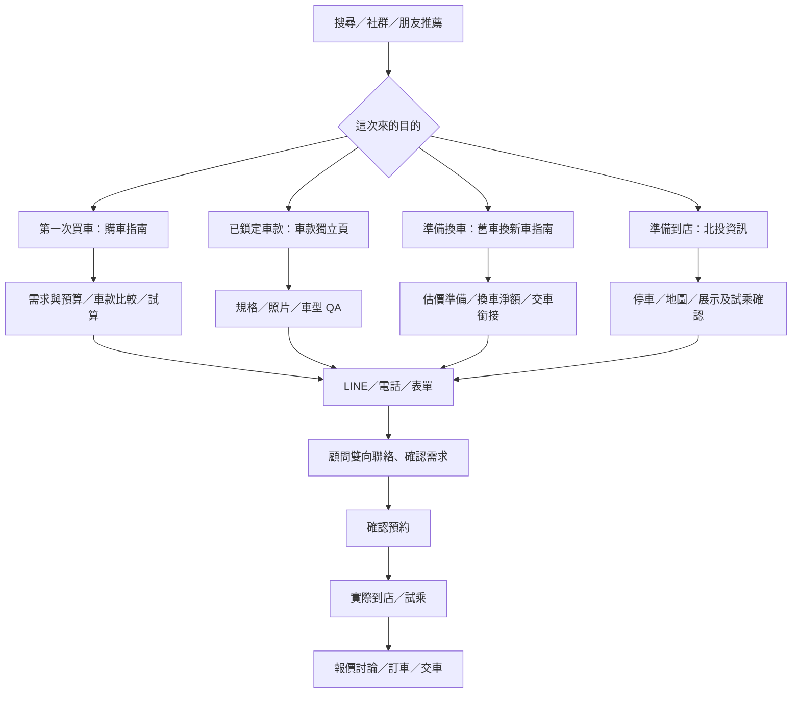

# 網站健檢與用戶旅程模擬

檢查日期：2026-09-09（台灣時間）。正式網站：https://suzuki-taipei.com/ 。本機版本：`0fa03b6`。本報告是本次檢查快照，不取代 OPERATIONS.md；沒有修改網站程式、更新套件、推送或部署。

## 判斷

網站已具備完整的顧問介紹、六款車介紹、比較、貸款試算、新手／換車指南、FAQ 及聯絡路徑。主要技術基礎正常。優先工作是修正試算輸入錯誤、更新有漏洞的間接依賴，以及讓閱讀／試算後的訪客更容易完成下一步。

不給任意總分：功能驗證、SEO 可存取性、真實效能與實際轉換率是不同證據，不能用一個分數掩蓋未測範圍。下文的用戶動機與流失風險是模擬假設，不是真人訪談或分析報表結論。

## 本次實際驗證

| 範圍 | 結果 | 限制 |
| --- | --- | --- |
| 單元測試 | `npm test`：22/22 通過 | 儲存與通知採模擬依賴 |
| 建置與瀏覽器回歸 | `npm run test:browser`：含正式建置，36/36 通過；1280×900、360×780 | 本機隔離伺服器；API 與分析外送由測試攔截 |
| 正式頁面 | sitemap 的 12 頁全部 HTTP 200；每頁一個 H1、唯一對應 canonical 與 title | HTTP 200 不代表 Google 已收錄 |
| 搜尋入口 | robots 允許抓取且指向正確 sitemap；不存在路徑 404；HTTP／www 最終導向 HTTPS 裸網域並回 200 | 未重新查看私人 Search Console |
| 正式互動 | 首頁→指南→新手預算段落；首頁→SWIFT→購車諮詢；到店頁；試算異常輸入 | 未點擊外部聯絡送訊、撥電話或送出正式表單 |
| 車款帶入 | SWIFT 頁「購車諮詢」帶入 SWIFT，焦點為 `contact-heading` | 正式收件及外部通知未驗證 |
| 手機／桌面視覺 | 檢視首頁、手機 SWIFT 與表單、桌面到店頁；抽查 DOM 無水平溢出；回歸另涵蓋內容頁 | 是瀏覽器尺寸模擬，不是真機 Safari 驗證；瀏覽器縮放已以實際 innerWidth／innerHeight 校正 |
| 依賴 | `npm audit --json`：1 項 moderate，0 high／critical | 不等於完整滲透測試；舊報告 0 漏洞不再代表目前結果 |
| 格式 | `git diff --check` 通過 | 未部署 |

測試中的儲存失敗、通知失敗及未知靜態路徑 `NoFallbackError` 為測試情境日誌；對應測試通過且未知路徑回 404。正式瀏覽可能產生一般 GA4 頁面／入口事件，本次操作不可當成自然客戶成效。

網頁搜尋工具取回的首頁文字與即時瀏覽器／直接 HTTP 內容不同；本報告以即時正式頁面及直接 HTTP 為準，不把搜尋工具快取差異判為網站故障。

## 確認問題與改善優先序

P1＝下一輪維護優先；P2＝轉換或可用性改善；P3＝維運整理。沒有在本次證據中發現需要立即停站的問題。

### F1｜P1｜車價欄位接受無效值，且數字解析會算錯（正式站可重現）

- 位置：首頁服務「貸款試算」→車價；`src/components/LoanCalculator.tsx:23`。
- 保持 80% 成數、60 期、3%，輸入 `-800000`：畫面顯示頭期款 `-160,000 元`、貸款總額 `-640,000 元`，沒有明確欄位錯誤。
- 輸入數字欄位可接受的 `1e6`：應拒絕此格式或解析為 1,000,000，實際卻以 `parseInt` 取為 1；顯示貸款總額 1 元、每月 0 元。
- 建議：統一解析與驗證車價，拒絕負數、非有限值及超出合理範圍的數值；空白或無效輸入顯示明確提示，隱藏衍生金額。若允許科學記號則正確解析，否則明確拒絕。不要只在 HTML 上加 `min`，計算層也要驗證。
- 驗收：正常車款與手動金額結果不變；負數、0、空白、科學記號、極大數不顯示誤導金額；補上有意義的邊界回歸。既有回歸只涵蓋利率邊界，故全數通過仍可能有此錯誤。

### F2｜P1｜間接依賴有 1 項中度漏洞（掃描確認）

- `npm explain baseline-browser-mapping`：Next.js 16.3.4 → `baseline-browser-mapping@2.10.33`；鎖檔亦為此版本。
- 公告 GHSA-w5vr-8v7q-w6rv：受影響範圍 `>=2.0.0 <2.11.0`，無效／衝突參數可能導致程序結束；修補版本 2.11.0。來源：[GitHub 安全公告](https://github.com/advisories/GHSA-w5vr-8v7q-w6rv)。
- 建議：在相容範圍內更新此依賴及鎖檔，重新跑 audit、單元、建置與瀏覽器回歸；不使用 `--force` 盲目升級。
- 未證明公開路由能讓外部使用者觸發這個套件的問題，也沒有發現本站因此停機。不能把套件公告直接解讀成本站已被攻擊。

### F3｜P2｜服務卡片外觀相近，但只有一半能操作（介面確認；影響待驗證）

- `src/data/site.ts:286`、`src/components/HomePageClient.tsx:262`：新車介紹、車款比較、購車諮詢沒有 href；試乘、貸款試算、交車服務有連結。
- 訪客可能把六張卡片都當入口，點擊前三張卻沒有後續。
- 建議：新車介紹連至車款區、比較連至選車區並說明先選兩款、購車諮詢連至表單；或明確把靜態服務介紹做成不同外觀。不要直接開啟沒有已選車款的空比較表。
- 驗收：視覺上可操作的卡片都可用鍵盤與觸控完成預期動作。

### F4｜P2｜讀完指南／算完月付後，下一步聯絡不夠就近（動線確認；流失為假設）

- 新手指南結尾已有很實用的諮詢訊息範例，但 LINE／電話主要按鈕在文章前方，文末只提供 QA 與換車指南連結。
- 首頁試算在聯絡表單下方；算完沒有直接返回諮詢的結果操作，也不會把試算車款同步到諮詢表單。
- 手機表單隱藏 QR Code 合理，但錯誤／成功訊息提到 LINE 時沒有就近可操作的替代路徑。
- 建議：沿用既有「每頁一組主要聯絡按鈕」與首頁三卡原則，長文末用次要文字「帶著這些問題詢問鈺漣」回到既有聯絡組；試算結果提供單一「詢問這款車」返回表單並預選車款。錯誤狀態再顯示 LINE 備援，不增加常駐重複按鈕列。
- 驗收：從文章尾端／試算結果可直接到聯絡；草稿與案件 ID 規則維持；沒有擅自將試算數字送到外部服務。效果需看實際諮詢，不能預估提升百分比。

### F5｜P2｜表單必填／選填和回覆預期不夠明確（程式與畫面確認）

- 表單五欄只有姓名、手機 required；畫面未明示用途與預算可跳過，且「聯絡方式」實際只接受台灣手機。
- 成功訊息為「我會盡快與你聯繫」，頁面另有「即時回覆」，但沒有可核實的顧問回覆時段或預期。
- 建議：標示姓名／手機必填，其他選填；欄名改成台灣手機或補格式提示。在業主能履行的範圍內提供回覆時段，不自行承諾幾分鐘或 24 小時內回覆。將「已收件、不等於完成試乘預約」也放到成功狀態附近。
- 驗收：只填必要資料可提交隔離測試；手機格式錯誤可理解；已有輸入及重試去重保留。

### F6｜P2｜現有量測看得到聯絡，較難定位選車到聯絡之間的摩擦（程式確認）

- `src/lib/analytics.ts` 白名單為 page_view 及 LINE／電話／地圖／諮詢入口／持久收件；沒有比較開啟、試算使用、開始填表與表單錯誤事件。
- 建議：先增加少量決策必要事件，例如 `compare_open`、`calculator_use`、`form_start`、`form_error`；以每次使用階段去重，避免拖曳滑桿每次都送出。錯誤只送固定分類，不送姓名、手機、草稿、案件編號或自由文字。
- 區分網站漏斗（瀏覽→意向→持久收件）與私人營運漏斗（雙向聯絡→有效需求→確認預約→到店）。LINE 點擊不等於加好友，表單收件不等於預約。
- 現有樣本有限，先累積觀察，不建議立即以小流量 A/B 測試宣稱勝負。正式追蹤設定變更另依授權執行。

### F7｜P3｜維運文件尚有發布前描述（文件與正式內容比對）

- OPERATIONS.md 最末仍保留新手／換車指南「本機尚未部署」及發布前確認；正式網站已可讀到兩篇、顧問經歷及對應 canonical，Git HEAD 為 `0fa03b6`。
- 建議新增發布後驗收紀錄，保留原歷史段落；實際部署 ID／Git SHA 需從部署平台核對，不能只憑頁面內容宣稱完全相同建置。

## 模擬用戶旅程

以下為情境走查，不包含真實客戶個資、真人情緒分數或虛構轉換率。箭頭為合理旅程，不保證每名訪客照同一路線行動。

| 情境 | 想解決的事／模擬心聲 | 現有旅程 | 摩擦與感受假設 | 建議與判斷方式 |
| --- | --- | --- | --- | --- |
| 第一次買車 | 「我不知道要準備多少錢，也怕問得不專業」 | 首頁／搜尋→指南總覽→新手預算→試算→諮詢 | 指南降低不確定；試算只可用 50–90% 貸款成數、無直接自備款輸入，與心中預算可能不好對照；結果缺乏下一步 | 保留訊息範例；試算新增自備款方式作為後續功能，先修正輸入與回聯絡路徑；觀察試算使用者的聯絡意向 |
| 已鎖定 SWIFT／Jimny | 「我想確認空間、規格與能不能試乘」 | 車款頁→照片／QA→LINE，或導覽購車諮詢 | 首段價格與雙按鈕明確；正式 SWIFT 表單預選正常；深讀後需回找入口 | 保留已正常的車款帶入；檢查閱讀末端回到聯絡的操作；分車款看有效需求，不只看點擊 |
| 家庭換車 | 「舊車賣掉後要補多少？會不會有空窗？」 | 換車指南→估價與交接→LINE／電話 | 文章能解釋流程；聯絡後仍須重述現有車輛與期望日期 | 在現有文字提供可複製的估價準備清單（年份、車型、里程、是否有貸款、期望交接日）；證件及銀行資料走既有安全管道；觀察首次聯絡能否取得足夠資訊 |
| 台北到店／外縣市客戶 | 「在哪裡停車？有我要的試乘車？白跑怎麼辦？」 | 到店頁→停車與時間→聯絡→確認→地圖 | 免費停車及先預約說明清楚；時段與試乘車仍需人工確認，這是實際作業而非功能故障 | 維持「先確認再出發」；在真人回覆中一次提供車款、日期、地址、停車與需攜物；用確認預約→實際到店評估 |

共同的心理旅程假設是「不確定→取得資訊→形成偏好→願意聯絡→等待確認」。本站前半段內容已充足，較值得改善的是資訊理解後的行動銜接及收到需求後的回覆預期。

## 建議執行順序

1. **下一輪維護**：修正 F1，處理 F2，補對應驗證；更新本次發布狀態紀錄。這些工作不必伴隨全面改版。
2. **下一輪小幅 UX 改善**：先處理服務卡片 F3、表單標示 F5，再試行 F4 的閱讀／試算下一步。保留首頁三張聯絡卡、內容頁單組聯絡及既有品牌稱呼，不重新堆疊按鈕。
3. **之後 2–4 週觀察**：依 F6 補足必要量測；每週看著陸頁、聯絡意向、持久收件和人工有效需求。數據不足就延長觀察，不宣稱改版造成成長。
4. **效能與搜尋補測**：對首頁、SWIFT、新手指南量測手機 PageSpeed／實際 Core Web Vitals；在 GSC 核對 12 頁的索引、Google canonical 與改版轉址。不要只因看見原生 img 或外部字型就斷言速度不佳。

## 尚未核實的範圍

- 真實速度：未取得 Lighthouse 分數、CrUX 或真實使用者 LCP／INP／CLS，不能判為通過。Google 建議以第 75 百分位檢查 LCP ≤2.5 秒、INP ≤200 毫秒、CLS ≤0.1；這是後續驗收標準，不是本站本次測值。[Web Vitals](https://web.dev/articles/vitals)
- 搜尋成效：沒有重新讀取 GSC／GA4 私人報表；現有 metadata、sitemap 正常不代表收錄或排名良好。依官方建議使用索引與成效報告驗證。[Search Console 使用說明](https://developers.google.com/search/docs/monitor-debug/search-console-start)
- 收件營運：程式與模擬測試確認「先持久保存、再通知、UUID 去重」；正式 Blob／Discord／Sheets 全鏈路、待辦追蹤及保存期限仍需按私人紀錄核對。
- 部署平台：Vercel 方案及先前延後的商用資格未查帳務；本次不據舊紀錄判定現行方案，也未更動設定。
- 車輛內容：本次檢查結構、來源呈現及優惠日期測試，未逐份重核六車所有官方規配表、當月方案或法規內容；原價格與資料核對日期均未更動。
- 安全與無障礙：有 API 程式檢視、依賴掃描、鍵盤與版面回歸；不構成完整滲透測試、所有外部接收端審查、螢幕閱讀器或 WCAG 全面認證。
